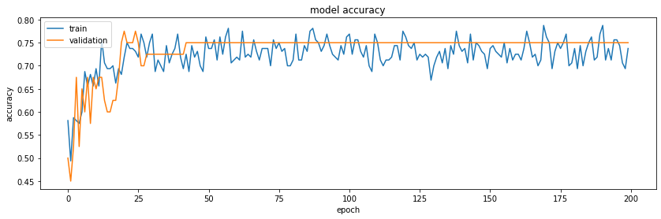
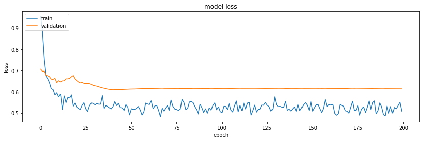
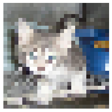

# Cat & Dog classifier project

## Table of contents
* [Introduction](#introduction)
* [Constraints](#constraints)
* [Dataset](#dataset)
* [Model](#model)
* [Predicting](#predicting)
* [Conclusion](#conclusion)

## Introduction
This project is a simple cat & dog classifier. It uses the [Keras](https://keras.io/) deep learning library to build a convolutional neural network. The network is trained with a sample of the Cats-vs-Dogs dataset from [Kaggle](https://www.kaggle.com/datasets/shaunthesheep/microsoft-catsvsdogs-dataset).

## Constraints
Some constraints were imposed on the project:
* Use only 100 images of each class (cat or dog)
* Use 80% of the data for training and 20% for validation
* Use Python, Jupyter Notebook and Keras
* Resize the images to 28x28 pixels
* Use CNN architecture

## Dataset
### Download
* The dataset is available on [Kaggle](https://www.kaggle.com/datasets/shaunthesheep/microsoft-catsvsdogs-dataset).

### Preprocessing
* When working with data, it is important to verify if it is not corrupted. Images are stored in the `jpg` format. To verify if the images are not corrupted, we try to open it and delete it if it fails. It is done in the notebook at: `2. Removing corrupted images`.
* Then we manually pick 100 images of each class (cat or dog) and store it in a new folder.
* We generate a train and validation set by splitting the dataset in 80% and 20% respectively. Datasets generation is done in the notebook at: `3. Generating datasets` and use the keras image_dataset_from_directory function to load the images. The most important parameter here is the crop_to_aspect_ratio parameter. It is used to resize the images to 28x28 pixels without inducing any distortion.

### Data augmentation
* In order to improve the robustness of the model, we use data augmentation. This is done in the notebook at: `5. Data augmentation` and use RandomFlip and RandomRotation to augment the images.

## Model
### Architecture
* The model is a convolutional neural network. You can find the architecture in the notebook at: `6. Model architecture`. It is composed of:
    * Three convolutional layers used to extract features from the images. We use a kernel size of 3x3 to get high frequency features.
    * Two fully connected layer used to classify the images.
    * Between the convolutional layers and the fully connected layer, we use a pooling layer to reduce the size of the feature maps. The pooling layer is used to reduce the number of parameters in the model. This also allow the last convolutional filter to have access to lower frequency features without having to use a large number of parameters.
    * In order to reduce overfitting, we use a dropout layer. The dropout layer is used to randomly drop some of the neurons in the fully connected layer.
    * ReLu activation function is used to prevent the model from getting stuck in local minima.
    * The last layer use a sigmoid activation function to output a probability between 0 and 1 to be a cat or a dog.
* The hyperparameters of each layer are tuned by training the model again and again.

### Training the model
* The training of the model is done in the notebook at: `7. Training the model`. The model is trained for about 100 epochs and a batch size of 10.
* The model is compiled with the Adam optimizer and the binary crossentropy loss function because the classification problem as two classes. The metric used is accuracy.
* The training is done with the Keras fit function. This function allows to save history of the training. We are interested in the variables accuracy and loss. A plot of these is done in the notebook at: `8. Saving the model`. Please see the plot to understand the evolution of the accuracy and loss during the training bellow.
    * In theses plots, we can notice that the accuracy quickly increases (about 25 epochs to converge). Validation accuracy is strongly correlated with the train accuracy: the model is probably not overfitting.
    * The loss is decreasing. This is because the model is learning the relationship between the images and the labels. The loss (train and validation) also converges in about 25 epochs.

## Predicting
* We can use the model to predict the class of an image. This is done in the notebook at: `9. Predicting`. The model is loaded and the image is preprocessed. The image is then passed to the model and the prediction is made. The prediction is made with the predict function. For example, the image bellow is predicted as a cat with a probability of 93.8%.

## Conclusion
The model is trained on a sample of the Cats-vs-Dogs dataset and the best result is achieved with a validation accuracy of 75%. This is a good result because the model is not overfitting despite the small amount of data and the small size of the images.